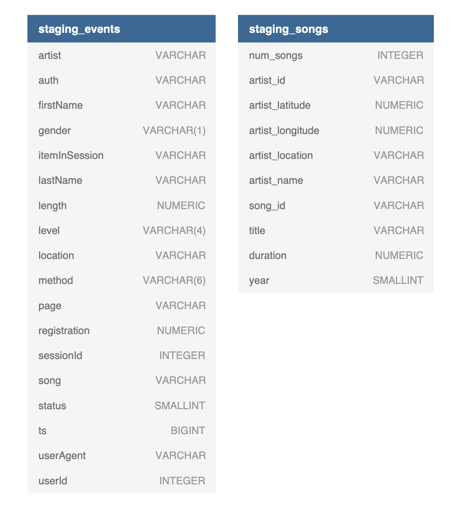
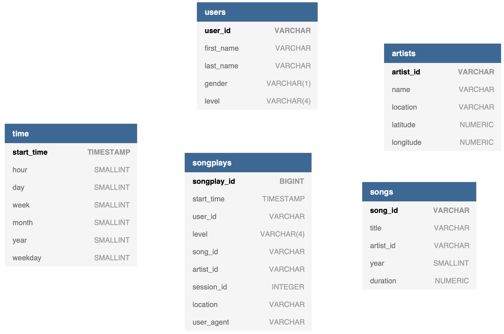
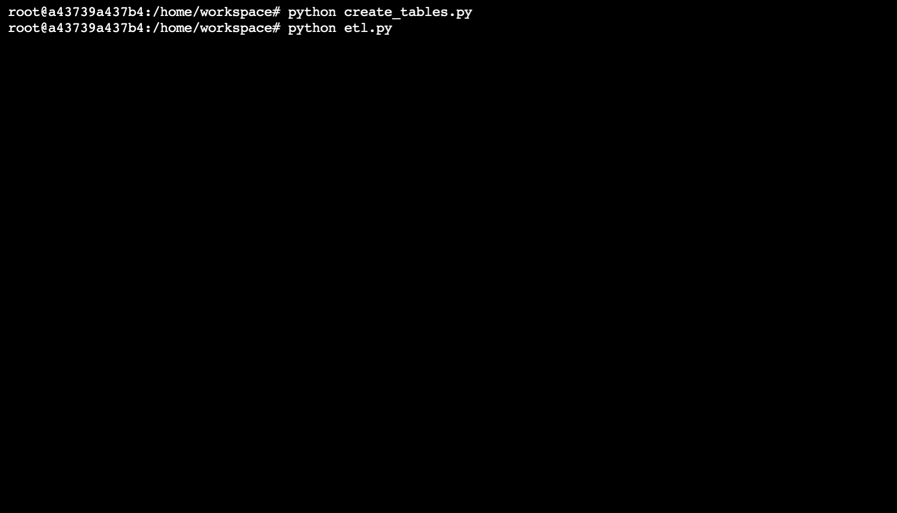

<h2>Project Overview</h2>

This project is implemented for Sparkify which is a music streaming platform to be able to perform analytical processes on their everwith the best use big data technologies. 
The scripts included in this project are written for Sparkify to be able to load their data from Amazon S3 into the staging tables that are in Amazon Redshift and then into their final tables in the most efficient manner and can be used with any redshift cluster type. All data can be staged and loaded after running a few scripts.

<h2>Files Included</h2>

<ol>
      <li><code>sql_queries.py</code> - All INSERT, DROP, COPY,  CREATE queries are written and organized here.</li>
     <li><code>create_tables.py</code> - Table creation functions for both staging and final tables are written here and it is imperative to run this script before anything else.</li>
     <li><code>etl.py</code> - All ETL pipeline operations reside here and this can be executed after the tables are created.</li>
      <li><code>dwh.cfg</code> - All configuration settings and credentials that are needed for accessing the AWS service is written here.</li>

</ol>

<h2>ETL Pipeline</h2>

The ETL process is written inside <code>etl.py</code> script. It includes two functions, one of which will load staging data from Amazon S3 into the staging tables and the other one will extract appropriate values from the staging tables to be inserted into the fact and dimension tables. This will run smoothly if the AWS entities had been setup accurately.

<h2>Database Schema Design</h2>

The database is implemented using star schema for fast data reads which is essential for Sparkify’s situation because they will possibly have to analyze thousands of data daily. Since it is a music streaming app, user load will be high and the data will be logged simultaneously no matter what time of the day. The use of star schema enables the analytical processes to be done in the fastest way possible and the use of Amazon Redshift to host the database provides consistently fast query performance.
 
 
There will be two staging tables whose sole purpose is just to copy and load data from the S3 bucket. Doing so makes the data population into the final tables faster and enables the data to be processed or reshaped easily with just a few lines of query without the need to use additional python code. They are structured as below:

    

 
The columns names are kept the same as the ones in the source file to avoid confusion and there are no restrictions added to the columns to get the most data possible from the source.

 
    
The main implementation is comprised of five tables, <strong>songplays</strong>, <strong>users</strong>, <strong>songs</strong>, <strong>artists</strong> and <strong>time</strong> with <strong>songplays</strong> table being the fact table. Amazon Redshift doesn’t actually enforce primary or foreign keys but primary keys are added here on all the tables where data integrity is necessary. Foreign keys are left out because it would cause some errors in our current data where some reference ids can be NULL. Data types for each fields of the tables are specified carefully that conforms to the data that is going to be imported. For instance, SMALLINT data type is used for ‘year’ columns where the data could only be four digit numbers. In another case, upon further inspection of the data, it is found that user subscription levels are ‘free’ and ‘paid’ so, instead of using the usual VARCHAR, length specification is added to ensure data integrity. The implementation can be seen below:

   

 
Distribution style of ‘all’ is specified on <b>songs</b> and <b>artists</b> table so that they could be readily available across all nodes because they are most likely to be fetched frequently in almost every type of querying. For the other tables, distribution style is not specified and thus, Redshift will choose the one that most fits the amount of data.  For the dimension tables, their primary keys or ids have been set as sort key so that they could easily be accessed by the fact table which references them by their ids. For the fact table, user id is set as sort key and start time as distribution key which I think is the most suitable approach for a music streaming data with which, in most cases, we will be dealing with lots of user data logged on various time periods.
    
    
<h2>How To Run</h2>

- Open the terminal.
- Navigate to the project folder by entering <code><b>cd</b> path-to-the-project</code> in the terminal.
- Type <code><b>python</b> create_tables.py</code> in the terminal to execute the script and create the tables.
- Running this script will DROP all the tables so, be sure to take a snapshot prior to running the script if there is existing data.
  

    
- If you encounter any errors, make sure that you used consistent table names across all queries and check the order in which the queries are run because these are the common source of problems most of the time.
- After a few seconds, the cursor reappears like in the picture below which indicates that the process is successful:

- After the tables had been successfully created, the ETL process can be done. To run the script, <code><b>python</b> etl.py</code> into the terminal and then hit Enter.

- The amount of time it would take vary on the type of redshift cluster that you are working with, its processing speed and the number of nodes it has. It could take from 15 minutes to an hour. The cluster should be resized and adjusted to your needs if this process is taking to long.

- The cursor will reappear after the ETL process is finished as shown below:
    

<h2>Technologies Used</h2>

<ul>
<li>
 
[configparser](https://docs.python.org/3/library/configparser.html) - Configuration file parser

</li>
    
<li>
    
[psycopg2](https://www.psycopg.org/) - Postgres database adapter for Python
    
</li>
</ul>

